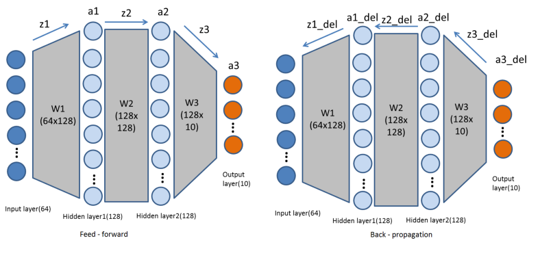

# Neural Network From Scratch
Multiple types of neural networks hardcoded in Python from scratch without using any framework to understand their fundamental functioning.

## Artificial Neural Network
Reference - https://towardsdatascience.com/neural-networks-from-scratch-easy-vs-hard-b26ddc2e89c7 

 - The dataset used is the sklearn digits datasets which consists of 1797 number images of resolution 8x8. 
 
 - The Neural Network model used can be seen below.

- Results

After 1000 epochs

| Loss   | Train Accuracy | Test Accuracy |
|:-------|:---------------|---------------|
| 0.00213| 99.87          |  98.33        |

[//]: <> (## Convolutional Neural Network)
[//]: <> (Reference - https://towardsdatascience.com/lets-code-convolutional-neural-network-in-plain-numpy-ce48e732f5d5 )

## Coming soon

- CNNs

- LSTM-RNNs